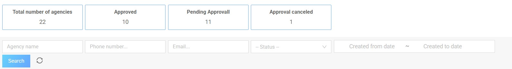
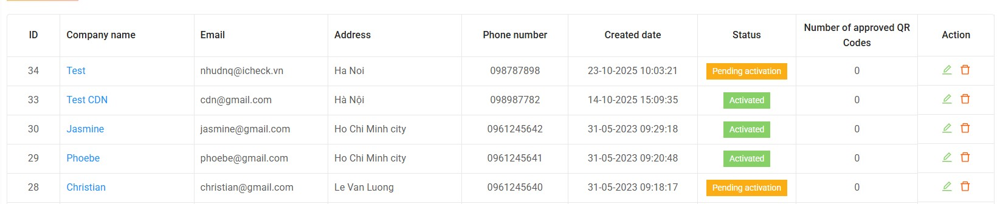
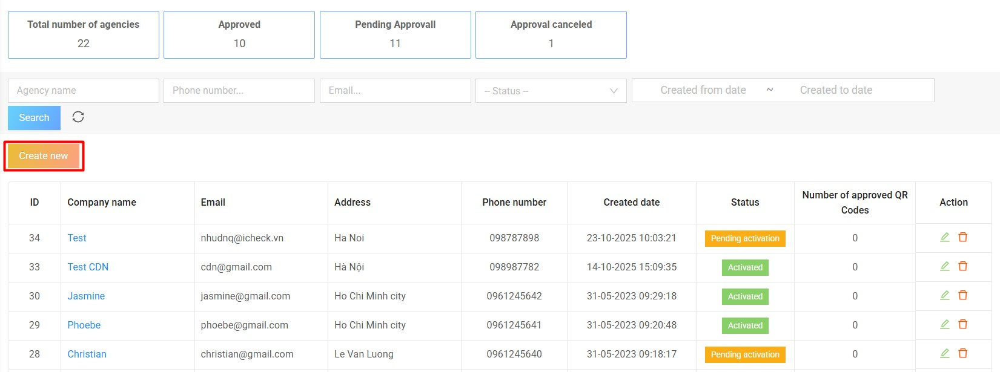
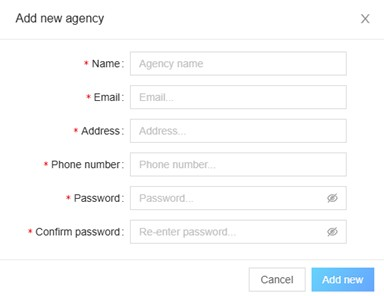
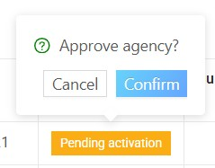
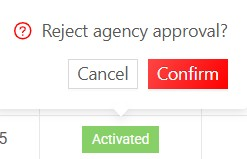

# 1. Agency management

## 1.1. List of agencies

This screen allows the **Admin** to view the list of all agencies in the system.  
At the top of the screen, the system summarizes the total number of agencies by status:
- Total number of agencies  
- Approved  
- Pending approval  
- Approval canceled  

**Admin can search or filter agencies using the following fields:**
- Agency name  
- Phone number  
- Email  
- Status  
- Created from date / Created to date 

**The list displays details including:**
- ID  
- Company name  
- Email  
- Address  
- Phone number  
- Created date  
- Status  
- Number of approved QR Codes  
- Action  

---

## 1.2. Create new agency

To create a new agency, click the **“Create new”** button on the list screen.  
Enter all required information fields, then click **“Add new”** to complete.

The system will automatically send account credentials to the email address entered during registration.  
The agency must check their email and follow the instructions to log in to the **qrcheck system**.

If the login account is a number that does not exist in the **iCheck system**, an account will be automatically created with any password.  
This account will be sent to the agent's email.  

If the login account is an existing account number in the **iCheck system**, the agent can log in with that account.  

---

## 1.3. Approve or reject agency activation

If an agency account is in **Pending activation** status, the **Admin** can approve or reject it directly from the list.  

**To approve:**  
Click the corresponding status in the **“Status”** column and confirm **“Approve agency?”**

**To reject:**  
Click the same status and confirm **“Reject agency approval?”**  
The system will update the agency’s status automatically after the action.

