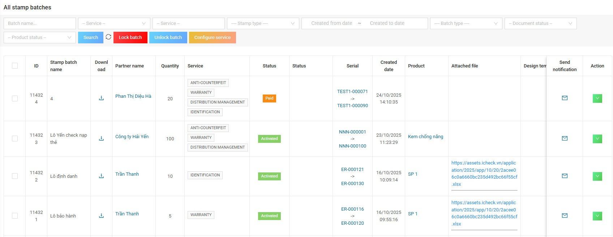
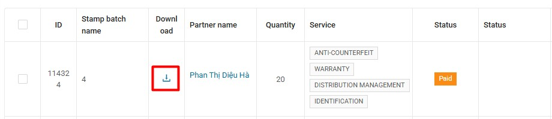
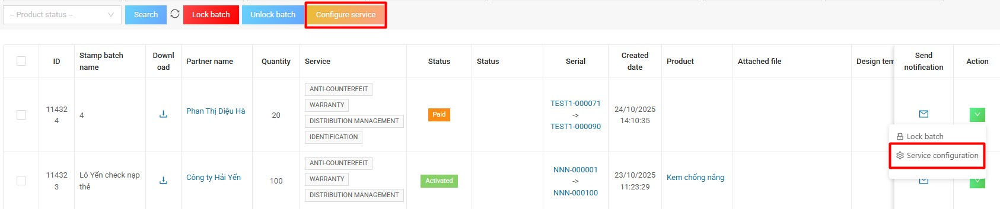
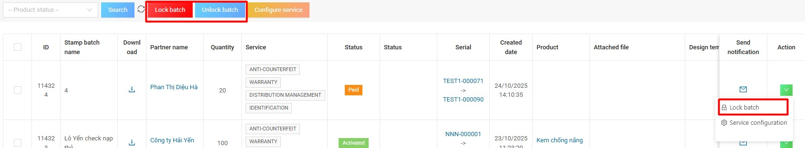
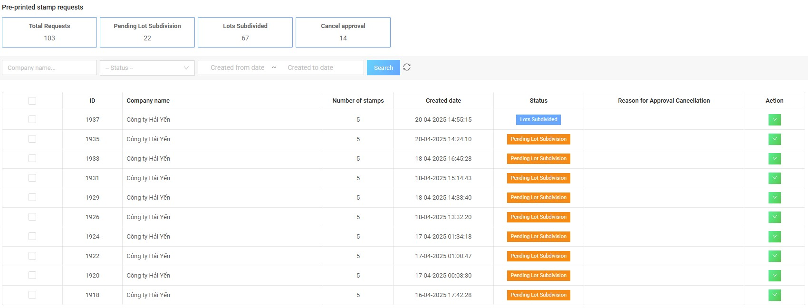

## 10. Stamp batch management

### 10.1. List of stamp batches
This function allows Admin to view a list of all stamp batches of the business. In this list screen, Admin can filter stamp batches by filters, especially the service filter including 4 services as below:

- Anti-counterfeit  
- Warranty  
- Return  
- Identification

Admin actions can be performed with stamp batches/businesses on this screen:
- Approve/unapprove products  
- Send notice to business  
- Lock lot  
- Service configuration with stamp batch  

---

### 10.2. Download the stamp batch
Admin press the button in the **Download** column to send the batch of stamps to the printer. After clicking the button, a popup will appear as follows:

Select the information to download, stamp partner, note for the printer and enter CMS login password to complete sending the stamp to the printer.  
The printer will receive an email with the print file and password to open the file.  
The business will receive an email notification that the admin has sent the file to the printer.

---

### 10.3. Edit service for each batch of stamps
This function allows Admin to update and edit services for any batch of stamps of the business on the system.

**To perform this function, the admin follows these steps:**

**Step 1:** In the action column, click and select **Service Configuration**.  
**Step 2:** Click to select or deselect the service, then select **Update**, the system will update the service for the stamp batch.

**Note:**
- Update service for batch → In the product management screen, the activation logs of the above batch will update the service accordingly.  
- This function is currently only open for Admin to perform from this CMS Admin, does not allow businesses to edit the service of the stamp batch on the business account.

---

### 10.4. Lock batch / Unlock batch
This function allows Admin to recall the stamp batch of the business.  

**To implement this feature, do the following:**
1. In the action column, select **"Lock batch"**.  
2. Enter the reason for locking.  
3. Confirm.  

To re-unlock the batch, on the action column, select **"Unlock"**. Enter the reason for unlocking the batch.

Admin can lock/unlock multiple batches by selecting multiple batches and clicking **"Lock/Unlock Batch"** at the top of the screen.

**Note:**  
Lock/Unlock batch A, all activation logs and product assignments of stamp strips belonging to batch A will be locked/unlocked accordingly.

---

### 10.5. Pre-printed Stamp Request
In the CMS menu, click **Pre-printed stamp request** to view the list of pre-printed stamp requests from enterprises.  

At the top of the screen, the system summarizes the total number of requests by status:
- Total requests  
- Pending lost Subdivision  
- Lost Subdivided  
- Cancel approval  

The list displays details such as:
- ID  
- Company name  
- Stamp quantity  
- Created date  
- Status  
- Rejection reason  
- Action

