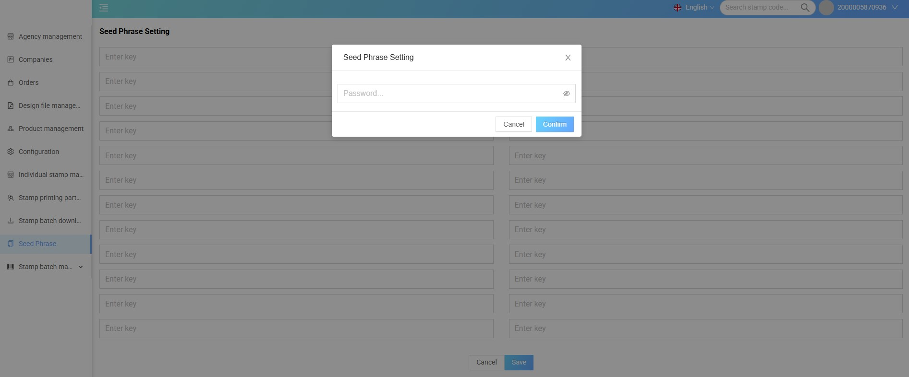

# Seed Phrase Setting

## General purpose
**Seed Phrase Setting** used to **manage and update 24 seed phrases (security keywords)** belonging to Cardano in the CMS system.  
Manage and update 24 keys (seed phrase) related to Cardano – for security tasks, signing transactions, or initializing blockchain wallets.  
This function is for **Admin only** and requires entering the **correct authentication password** before accessing, ensuring absolute security of wallet data.

---

## How to use

### List of “Enter key” input boxes
- There are **24 seed phrase input boxes**, corresponding to **24 security keywords** of the Cardano wallet.  
- The user (admin) needs to **enter all the keys** to set up or restore a wallet.  
- These cells have **no character limit**, but must be entered **exactly in a valid seed phrase format**.

---

### Step 1: Open the Seed Phrase Setting screen
- From the left menu, select the item **Seed Phrase**.  
- The system will display a prompt asking for a **security password** (as shown in the picture).

---

### Step 2: Verify access
- Enter **CMS Admin Password** → press **Confirm**.  
- If the password is correct, the **Seed Phrase Setting** screen will open to enter the seed phrase.

---

### Step 3: Enter seed phrase
- Each cell **Enter key** corresponds to a keyword in the seed phrase string (24 cells depending on system configuration).  
- Enter the **correct order and spelling of words**.  
- **Double check** before saving.

---

### Step 4: Save changes
- After entering, press **Save** to save the seed phrase.  
- The system will:
  - Perform **validation check** (enough quantity, correct format).
  - If valid → display **success message**.  
  - If error → display **corresponding error message**.

---

### Step 5: Cancel the operation (if necessary)
- Press **Cancel** to exit without saving any changes.
