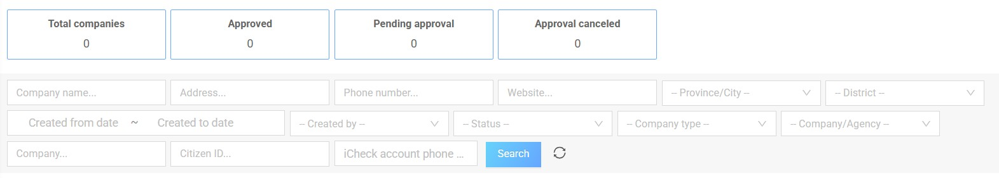
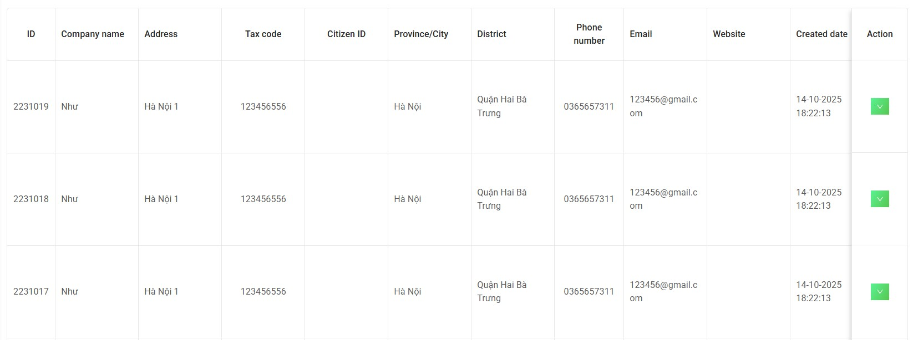
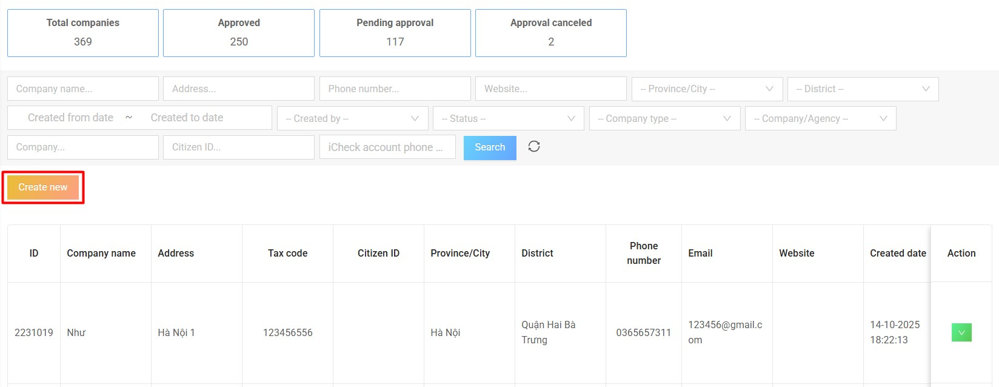
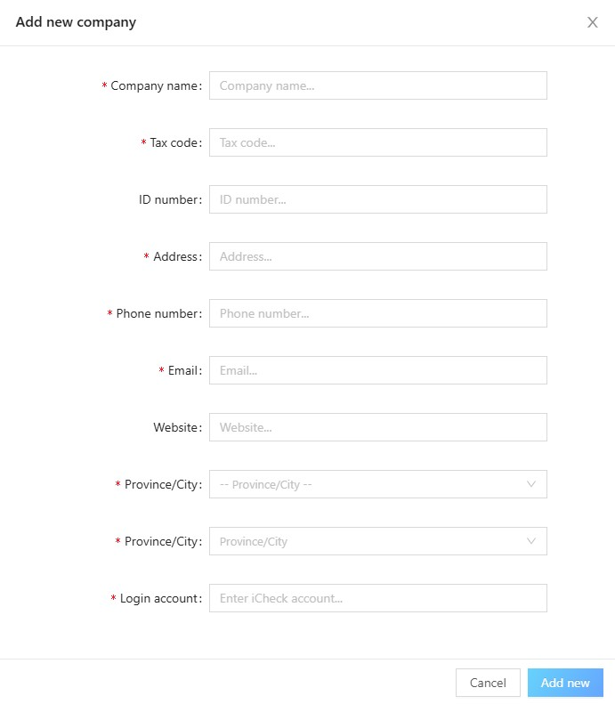
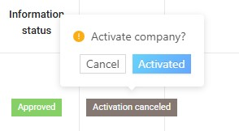
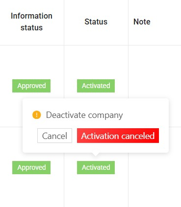

# 2. Companies

## 2.1. List of companies

This screen allows the **Admin** to view the list of all companies in the system.  
At the top of the screen, the system summarizes the total number of companies by status:
- Total companies  
- Approved  
- Pending approval  
- Approval canceled  

**The Admin can search or filter companies using the following fields:**
- Company name  
- Address  
- Phone number  
- Website  
- Province/City  
- District  
- Created from date / Created to date  
- Created by  
- Status  
- Company type  
- Citizen ID  
- iCheck account phone number  

**The list displays detailed information, including:**
- ID  
- Company name  
- Address  
- Tax code  
- Citizen ID  
- Province/City  
- District  
- Phone number  
- Email  
- Website  
- Created date  
- Created by  
- Company type  
- Information status  
- Action  

---

## 2.2. Create new companies

To create a new company, click the **“Create new”** button on the list screen.  

Fill in all the required fields in the **Add new company** popup, including:
- Company name  
- Tax code  
- ID number  
- Address  
- Phone number  
- Email  
- Website  
- Province/City  
- Login account  

Then click **“Add new”** to complete.  

The system will send account information to the email entered earlier with the registered information.  
The company logs in to the email and follows the instructions to log in to the **qrcheck system**.

If the login account is a number that does not exist in the **iCheck system**, an account will be automatically created with any password.  
This account will be sent to the company's email.  

If the login account is an existing account number in the **iCheck system**, the company can log in with that account.  

---

## 2.3. Activate/Deactivate Account

In case a company creates an account, the **Admin** will be the one to approve the account for the company.  

**To activate the account:**  
- Click on the corresponding status in the **“Status”** column.  
- Select **“Activate”**.  

**To deactivate the account:**  
- Click on the corresponding status in the **“Status”** column.  
- Select **“Deactivate”**.  

