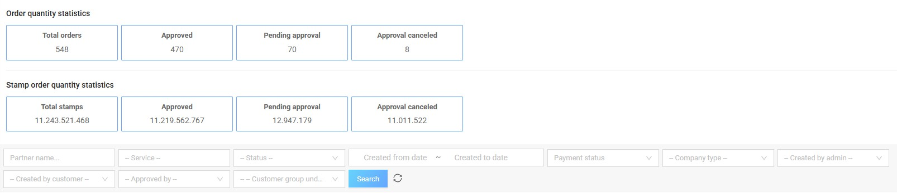
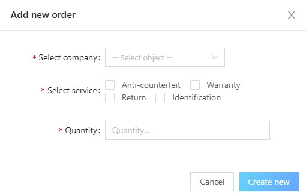

# 3. Order Management

## 3.1. Order list

This screen allows the **Admin** to view a list of all orders created by the business.

In the filter, the Admin can filter by services:

- Anti-counterfeiting  
- Warranty  
- Return  
- Identification  

On this screen, the Admin can perform the following tasks:

- **Order approval**  
- **Cancel order approval**  
- **Order recall**  
- **Payment confirmation**

Additionally, the Admin can:

- Filter the order list  
- Track order statistics and number of stamps ordered  
- Export order data to Excel  

---

## 3.2. Create an order

This function allows the **Admin** to create orders for businesses.

To create an order, the Admin follows these steps:

### Step 1
At the **Order list** screen, click the **“Create new”** button.

### Step 2
Enter information according to the form, including:

- Select a company  
- Select service  
- Enter the number of stamps  

### Step 3
Click **“Create new”** to confirm order creation.
