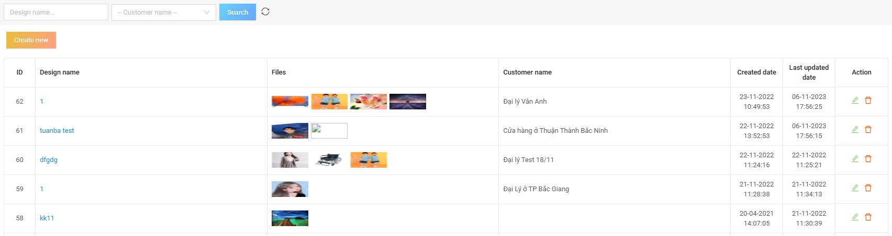
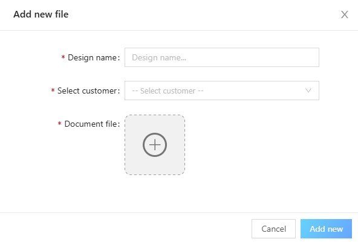

# 4. Design File Management

## 4.1. List of Design Files

This screen allows the **Admin** to view the entire list of stamp design files.  

**The information of a design file includes:**
- Design name  
- File (1 or more files)  
- Customer name  
- Date created  
- Last updated date  

**Actions with design files:**
- Update  
- Delete  

**Admin can also search for design files by:**
- Design name  
- Customer name  

---

## 4.2. Create New Design File

To create a new design file, the **Admin** clicks the **“Create new”** button on the file list screen, then fills in the following information:
- Design name  
- Customer  
- Upload design file  

Then click **“Add new”** to complete.  
