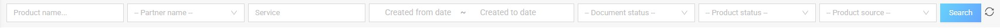
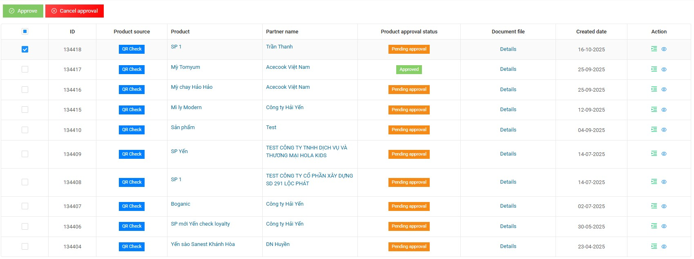

# 5. Product Management

## 5.1. Product list
Product management screen: Displays all products assigned to stamp batches and stamp bands of all businesses.  
Admin can filter products by:  
- Product name  
- Partner name  
- Services  
- Created from date - Created to date  
- Document status  
- Product status  
- Product source  

---

## 5.2. Review product documents
To approve/cancel product documentation  

**Step 1:** In the action column, click on the "Approve/Cancel approval" document icon  

**Step 2:** Perform approval/cancel approval accordingly.  

**Note:**  
- After 45 days from the date of cancellation; the system will automatically remove the "Anti-counterfeit" service of the activation and product assignment logs (see the list of activation and product assignment logs)  
- Review documents: Activation logs, after the "Anti-counterfeit" service is disabled (Because the system runs the job automatically). If the admin reviews documents then the logs will be updated with the "Anti-counterfeit" service.  

---

The logic for approving and canceling documents is as follows:  
- Pending approval documents: will have approval and cancellation features  
- Approved documents: Admin has the right to cancel approval.  
- Documents have been canceled: Admin has the right to re-approve.  
- Documents after approval/cancellation: If the companies adds a file → The status will be updated "Create new file"  
- Create new file document: Admin has the right to approve/cancel document re-approval.  
