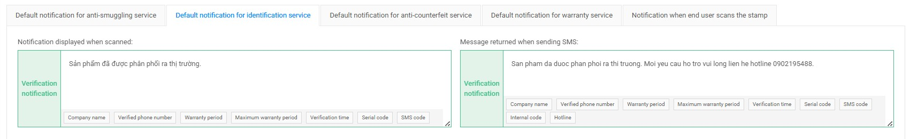
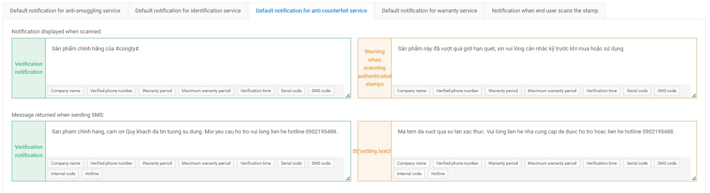
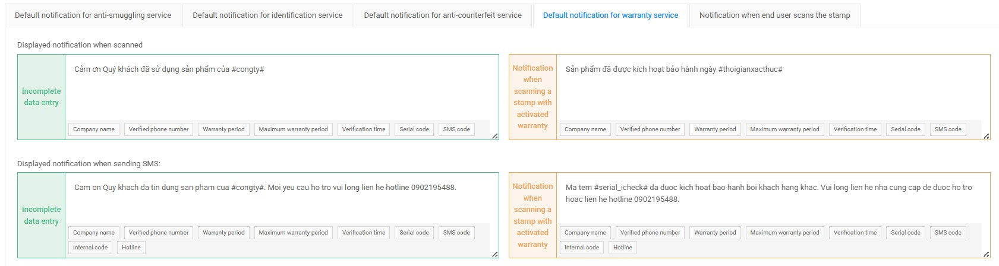
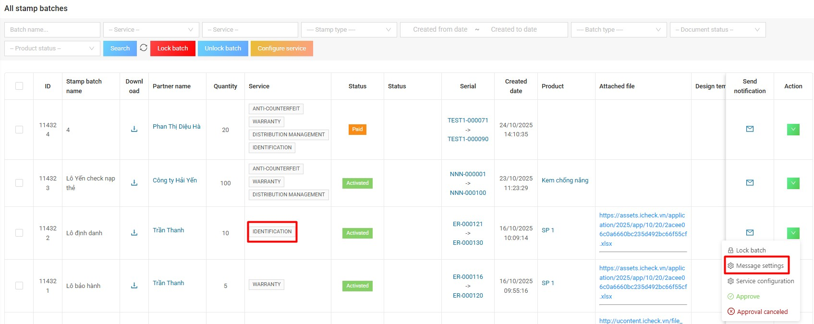

# 6. Configuration

This function allows **Admin** to set default messages for services (messages displayed on the app when the user scans the stamp).  
The interface includes several tabs:

- Default notification for anti-smuggling service
- Default notification for identification service
- Default notification for anti-counterfeit service
- Default notification for warranty service
- Notification when end user scans the stamp

To update, click on each tab to select the service and edit the message for each service.

## Function Overview

Each tab contains **default message templates**, divided into two sections:

---

### Notification displayed when scanned

This is the message shown on the user’s screen after scanning the QR/stamp.

You can customize the content and insert dynamic fields such as:

- `Company name`
- `Verified phone number`
- `Warranty period`
- `Maximum warranty period`
- `Verification time`
- `Serial code`
- `SMS code`

---

### Message returned when sending SMS

This is the automatic SMS reply message sent back to the user.

You may include helpful information, for example:

> “This is an authentic product of #company#.  
> For assistance, please contact our hotline #hotline#.”

---

## 6.1. Default notification for identification service
### 6.1.1. Identification services
Allowed to configure 2 messages:  
- Message displayed on the app when the user scans the QRI code  
- Message returned to the user when the user uses the SMS code of the text message stamp  

---

## 6.2. Default notification for anti-counterfeit service

With the **anti-counterfeit service**, admin can set **2 notifications on the app** and **2 return messages to users**, with 2 cases:  
- **Notification/Authentication Message:** when the number of scans/messages is less than the number of authentications set by the business  
- **Notification/Warning Message:** when the number of scans/messages exceeds the number of authentications  

---

## 6.3. Default notification for warranty service

With the **warranty service**, admin can set **2 notifications on the app** and **2 return messages to the user**, with 2 cases:  
- **Warranty activation notification/message:** when the customer first scans the QRI code or sends an SMS to the switchboard  
- **Notification/message when the stamp has activated the warranty:** when the customer scans the QRI code and sends an SMS, the warranty has been activated  

---

## 6.4. Configure default message of identification service for each batch of identification stamps

In addition to configuring the default message for stamps across the system, the admin can support setting messages for each batch of business identification stamps.  

- For batches of stamps with **anti-counterfeit and warranty services** ⇒ Enterprises proactively install on the granted account  
- For batches of stamps that only have **identification service** ⇒ Admin supports installation on CMS admin for each batch  

Because the identification stamp batches do not require documents, the admin needs to control the notification message that the company shows to the user when the user scans the stamp.  

**To set up a message for a batch of business identification stamps, the admin follows these steps:**

**Step 1:** In the stamp batch list, select one stamp batch that needs to install a message and click **Message setting** as shown in the instructions below.  

**Step 2:** Update the message on the popup and click **Confirm** to confirm saving the message.  
⇒ If this message is set on the stamp batch, the system will **prioritize this message** over the default message of the entire system.  
