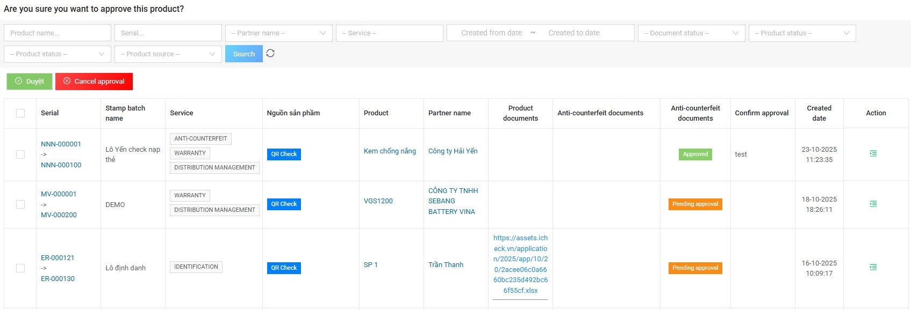
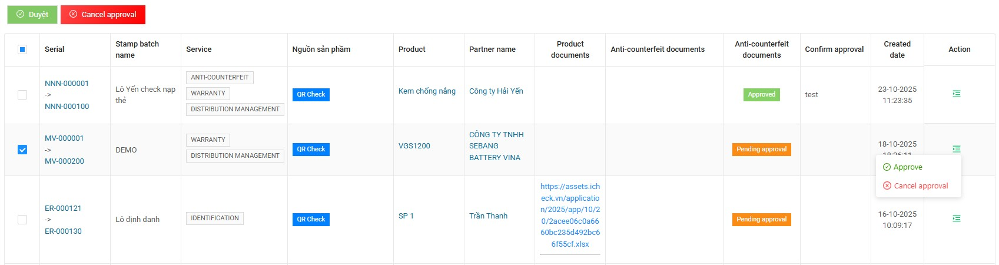

# 7. Individual Stamp Management

## 7.1. List of Individual Stamps

In the **CMS menu**, click **“Individual Stamp Management”** to display the list of stamps created from the system **qrcheck.icheck.vn**.

On this screen, the **Admin** can search for stamps using filters such as:  
- Product name  
- Serial  
- Partner name  
- Service  
- Created date  
- Document status  
- Product status  

The list displays detailed information, including:  
- Serial  
- Stamp batch name  
- Service  
- Product source  
- Product name  
- Partner name  
- Product document  
- Anti-counterfeit document  
- Approval confirmation  
- Created date  
- Action

---

## 7.2. Approve or Reject a Stamp

There are two ways to approve or reject:

### **Option 1: Bulk Approval/Rejection**
1. Select one or multiple stamps by ticking the checkboxes.  
2. Click **Approve** or **Reject** on the top of the list.  
3. Confirm your action.  
   → The system will automatically update the status in the **Anti-counterfeit document** column.  

---

### **Option 2: Approve/Reject Single Stamp**
1. Click the **Action icon (≡)** at the right side of the stamp.  
2. Choose **Approve** or **Reject**.  
3. The system will instantly update the approval status.
