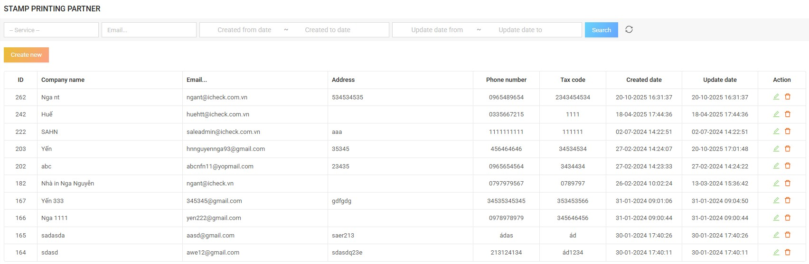
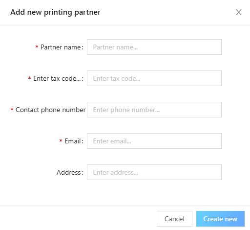

# 8. Stamp Printing Partner

## 8.1. List of stamp printing partners

In the **CMS menu**, click **"Stamp Printing Partner"** to display the list of stamp printing partners.  
Here, CMS can search for stamp printing partners according to the available conditions on the screen.  

**Admin functions:**
- Delete stamp printing partners  
- Update stamp printing partners in the action column  

---

## 8.2. Create new stamp printing partner

On the list screen, click the **"Create new"** button to display the popup for adding partners.  
Here, enter the necessary information to create a partner.  

After entering the information, click the **Create new** button — the new partner will then be displayed on the list screen.  

