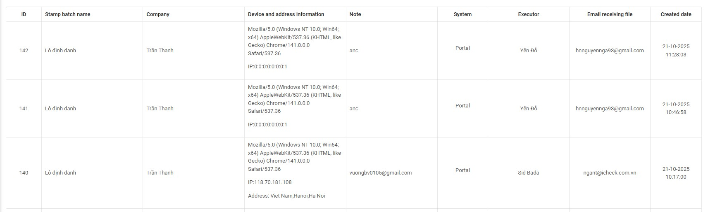

# 9. Stamp Batch Download History

On this screen, the **Admin** can search for stamp batch download records using the available filters such as:  
- ID  
- Stamp batch name  
- Portal executor  
- Company  
- Created from date  
- Created to date  

---

## Displayed Information

The system displays detailed information for each record, including:  
- **Company name**  
- **Device and address information:** The system automatically records browser type, device details, and IP address when a download occurs  
- **Note**  
- **System**  
- **Executor**  
- **Email receiving file:** Column displays the recipient of the downloaded file  
- **Created date**  

---

This function helps the **Admin** track and monitor stamp batch download activities for **audit** and **security** purposes.  
