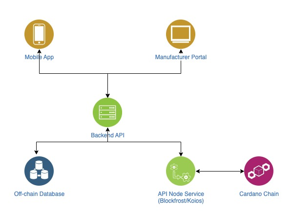

Status: Completed

# High-level Architecture

## Introduction

This document provides a high-level technical architecture overview of the anti-counterfeit QR code management system integrated with the Cardano blockchain. The goal is to present a comprehensive understanding of the main software and hardware components, along with their relationships and interactions. This document is intended for the technical team, technical stakeholders, and anyone requiring a clear understanding of the system's structure from a technical perspective.

## Technical Goals

The technical objectives of the system are to:
* Build a scalable system capable of handling a large volume of products and scans.
* Ensure the security of data and transactions, particularly concerning private keys and API communication.
* Guarantee the stability and reliability of the system.
* Effectively utilize Cardano blockchain features (metadata) for immutable and transparent storage of authentication information.
* Develop a robust and easily integrable API for the mobile application and other systems.
* Deploy a cost-effective solution for operation.
* Ensure minimal disruption when integrating with existing QR code infrastructure.

## Major Technical Components and Relationships

### Mobile Application

* **Platforms**: Cross-platform development for both iOS and Android.
* **Key Technical Functions**:
    * **QR Code Scanning**: Utilizes device camera APIs to scan and decode QR codes, returning the QR code value string.
    * **API Communication**: Employs HTTP/HTTPS libraries to send verification requests (containing the scanned QR code) to the Backend API (via the `/api/verify` POST endpoint) and receive responses (verification results) in JSON format.
    * **Response Handling**: Parses the JSON response from the Backend API to display the authentication status ("genuine," "counterfeit," "error") and detailed messages to the user.
    * **(Optional) Local Storage**: Stores a basic history of scanned QR codes (code, result, timestamp) on the device's local storage.
    * **Relationships**: Sends verification requests containing the scanned QR code to the Backend API and receives authentication results for display to the user.

### Backend API

* **Architecture (Overview)**: Can be implemented as a Microservices architecture (with core services like Authentication, Verification, Blockchain Interaction, Data Access).
* **Key Technical Functions**:
    * **Request Reception and Processing**: Handles verification requests from the mobile application (via the `/api/verify` POST endpoint) and (optionally) new QR code information from the existing QR code management system (e.g., via the `/api/qrcode/new` POST endpoint).
    * **Verification Business Logic**:
        * Queries the Blockchain Interaction Module to check the scan history of the QR code.
        * Determines if the scan is the first occurrence.
        * Decides the authentication status (genuine/counterfeit).
    * **Cardano Blockchain Interaction Module**:
        * Constructs Cardano transactions containing metadata (first scan information, initial product information - optional) according to the Cardano format using the CSL or its wrappers.
        * Manages private keys securely for transaction signing.
        * Communicates with the Cardano network via the API of a third-party API node service (e.g., Blockfrost, Koios) to submit transactions and query data.
    * **(Optional) Batcher Management Module**: Collects blockchain write requests and submits them in batches for cost optimization.
    * **Off-chain Data Management Module**: Interacts with the off-chain database to retrieve product information (based on the QR code) and (optionally) store scan-related data.
* **Relationships**:
    * Receives verification requests from the Mobile Application.
    * Interacts with the Cardano Blockchain to check scan history and record the first scan.
    * Interacts with the Off-chain Database to retrieve product information.
    * (Optional) Receives new QR code information from the Existing QR Code Management System.
    * Sends authentication results back to the Mobile Application.

### Cardano Blockchain

* **Network**: Cardano Mainnet.
* **Key Technical Functions**: Provides immutable storage for transactions containing metadata (initial product information - optional, first scan information) and enables querying of transaction history based on QR codes (via API nodes).
* **Relationships**: Serves as the trusted and immutable data source for product authentication.

### Off-chain Database

* **Type**: Relational database (e.g., PostgreSQL) or NoSQL database (e.g., MongoDB).
* **Key Technical Functions**: Stores detailed product information (ID, name, description, batch number), maps QR codes to product IDs, and (optionally) stores scan history (timestamp, location).
* **Relationships**: Provides detailed product information to the Backend API based on the QR code received from the mobile application.

## High-Level Deployment Architecture

* The system is planned for deployment on a cloud platform (e.g., AWS, Google Cloud, Azure) utilizing a microservices architecture (for larger scale) or a monolithic architecture for the initial phase.
* Backend API components will be containerized using Docker and managed by Kubernetes for scalability, stability, and ease of deployment.
* The off-chain database will likely use a managed database service provided by the cloud vendor (e.g., RDS PostgreSQL, Cloud SQL, MongoDB Atlas).
* Communication with the Cardano blockchain will be facilitated through a third-party API node service (e.g., Blockfrost, Koios) to simplify interaction with the network.

## Communication Protocols

* **Mobile Application - Backend API**: RESTful API over HTTPS, with JSON data format for both requests and responses.
* **Existing QR Code Management System - Backend API**: RESTful API over HTTPS (e.g., endpoint `/api/product/{qr_code_value}` GET returning product details), with JSON data format.
* **Backend API - Cardano API Node Service**: RESTful API over HTTPS, with JSON data format as specified by the API node service (e.g., Blockfrost, Koios).
* **Backend API - Off-chain Database**: Communication via the protocol and client libraries specific to the database type (e.g., JDBC for PostgreSQL, Mongoose for MongoDB).

All endpoints secured using HTTPS and token-based authentication (JWT where applicable).

## Key Non-Functional Requirements

* **Security**: Paramount importance, encompassing API security (HTTPS, authentication, authorization), secure blockchain key management (consider HSM), encryption of sensitive data (at rest and in transit), and adherence to industry security standards.
* **Scalability**: The system needs to be horizontally scalable to handle a large volume of user requests (e.g., using load balancers for the Backend API, microservices architecture).
* **Performance**: Aim for fast response times for users (quick QR code scanning and verification results - target under 2 seconds). Implement caching (e.g., Redis) for frequently accessed data to reduce load on the blockchain and database.
* **Maintainability**: Design the system following good design principles (e.g., modularity, separation of concerns) for easy maintenance, updates, debugging, and addition of new features.
* **Testability**: Implement a comprehensive testing strategy including unit tests, integration tests, and end-to-end tests to ensure system quality.

## Conclusion

This document provides a comprehensive high-level technical architecture overview of the anti-counterfeit QR code management system integrated with Cardano. It outlines the main components, their technical functions, relationships, the planned deployment architecture, communication protocols, and key non-functional considerations. This document will serve as the foundation for detailed design and development efforts.