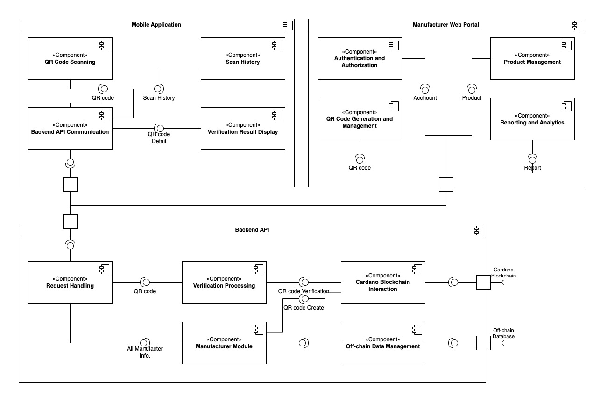

Status: Completed

# Components and Modules

## Introduction

This document details the main components of the anti-counterfeit QR code management system integrated with Cardano, breaking them down into smaller modules, and clarifying the specific functions and interactions of these modules to execute the system's operations. This document provides a deeper understanding of the system's internal structure, building upon the previously described high-level architecture, and serves as a crucial reference for the development team.

## Detailed Components and Modules

### Manufacturer Web Portal

#### Module: Authentication and Authorization

* **Function**: Manages user (manufacturer) login, registration, and access control to different features based on their roles and permissions.
* **Interactions**: Handles user credentials, verifies identity, issues and manages session tokens, and enforces access policies.

#### Module: Product Management

* **Function**: Allows manufacturers to create, view, edit, and manage their product information within the system.
* **Interactions**: Provides a user interface for data input and display, interacts with the Backend API (Off-chain Data Management Module) to store and retrieve product details.

#### Module: QR Code Generation and Management

* **Function**: Enables manufacturers to generate unique QR codes for their products (individually or in bulk) and associate them with specific product identifiers.
* **Interactions**: Provides a user interface for initiating QR code generation, interacts with the Backend API to trigger QR code creation and the association process (involving both Off-chain Data Management and Cardano Blockchain Interaction Modules).

#### Module: Reporting and Analytics (Optional)

* **Function**: Provides manufacturers with insights and reports on their tagged products, including (potentially) scan activity.
* **Interactions**: Queries data from the Backend API (Off-chain Data Management Module and Cardano Blockchain Interaction Module), processes and visualizes the data for reporting.

### Mobile Application

#### QR Code Scanning Module

* **Function**: Uses the device's camera API to scan and decode QR codes.
* **Interactions**: Initializes the camera, analyzes frames to detect and decode QR codes, returns the decoded QR code value string to the Backend API Communication Module.

#### Backend API Communication Module

* **Function**: Establishes network connections (using HTTP/HTTPS libraries) and sends verification requests (containing the QR code value) to the Backend API. Handles responses from the Backend API.
* **Interactions**: Receives the QR code value from the QR Code Scanning Module, constructs and sends POST requests to the `/api/verify` endpoint of the Backend API (request data in JSON format), receives responses from the Backend API (response data in JSON format), and forwards the authentication status and message (if any) to the Verification Result Display Module.

#### Verification Result Display Module

* **Function**: Presents the authentication result message (e.g., "Genuine - First Scan," "Counterfeit - Already Scanned," error messages) to the user on the application interface.
* **Interactions**: Receives the status and message from the Backend API Communication Module, updates the user interface to display the information clearly and understandably.

#### Scan History Module (Optional)

* **Function**: Locally stores a history of scanned QR codes and their corresponding verification results on the device. Provides a user interface for reviewing the history.
* **Interactions**: Stores scan information (QR code, scan time, result) upon receiving a response from the Backend API, retrieves and displays the scan history when requested by the user.

### Backend API

#### Request Handling Module

* **Function**: Receives HTTP requests from the mobile application (endpoint `/api/verify`) and from the Manufacturer Web Portal (e.g., `/api/product/create`, `/api/qrcode/generate`).
* **Interactions**: Handles requests, deserializes/serializes data, forwards requests to other modules.

#### Verification Processing Module

* **Function**: Implements the business logic to determine product authenticity.
* **Interactions**: Receives the QR code, calls the Cardano Blockchain Interaction Module to check scan history and record the first scan, returns the verification status.

#### Cardano Blockchain Interaction Module

* **Function**: Abstracts interaction with the Cardano network. Builds, signs, submits transactions, and queries data.
* **Sub-modules**: Metadata Transaction Builder, Key Management, Node Communication, Metadata Transaction Query.
* **Interactions**: Receives requests from other modules, interacts with the blockchain via the API node, returns results.

#### Batcher Management Module (Optional)

* **Function**: Groups multiple blockchain write requests to optimize costs.
* **Interactions**: Receives recording requests, manages the queue, calls the Cardano Blockchain Interaction Module to submit batch transactions.

#### Off-chain Data Management Module

* **Function**: Abstracts interaction with the off-chain database. Performs CRUD operations on product data and (optionally) scan history.
* **Interactions**: Receives query/storage requests, interacts with the database, returns results.

### Cardano Blockchain

**Role at the Application Level**: The Cardano blockchain is a decentralized infrastructure providing immutable transaction and data storage services. Our system does not deploy modules directly on the blockchain. Instead, the Cardano Blockchain Interaction Module (within the Backend API) acts as an intermediary to interact with this infrastructure.

**Interactions**: The Cardano Blockchain Interaction Module uses the API of a Cardano API node service (e.g., Blockfrost, Koios) to:
* Submit transactions containing metadata that records authentication-related information (e.g., first scan timestamp) and (optionally) initial product information.
* Query transactions and metadata to check the scan history of a specific QR code.

**In Summary**: The Cardano blockchain is the trusted data storage layer, and the Cardano Blockchain Interaction Module is the interface for our system to utilize this storage layer.

### Off-chain Database

**Role at the Application Level**: The off-chain database is an external data storage system used to house information that is not necessary or suitable for storage on the blockchain (e.g., detailed product information, QR code mappings, system management user information). Our system does not manage independent modules within the database. Instead, the Off-chain Data Management Module (within the Backend API) is responsible for managing and accessing this data.

**Interactions**: The Off-chain Data Management Module uses libraries or ORM/ODM to communicate with the database (e.g., PostgreSQL, MongoDB) to:
* Store detailed product information and its association with QR codes.
* Store system management user information and access rights.
* (Optional) Store scan history and other related data for tracking or analytics purposes.
* Retrieve product information based on the QR code received from the verification request or from the Manufacturer Web Portal.

**In Summary**: The off-chain database is the supporting data storage layer, and the Off-chain Data Management Module is the interface for our system to interact with this storage layer.

## Module Relationships (Summary)

* Manufacturer Web Portal interacts with the Backend API to manage products and QR codes.
* Mobile Application interacts with the Backend API to send verification requests and receive results.
* Backend API uses the Cardano Blockchain Interaction Module to read and write data on the Cardano Blockchain.
* Backend API uses the Off-chain Data Management Module to access and manage product and user information.
* Batcher Management Module (if implemented) within the Backend API optimizes blockchain transaction submissions.

## Conclusion

This document has detailed the main components of the system and broken them down into smaller modules, clarifying the function and interactions of each, including the roles of the Manufacturer Web Portal for administrative tasks and the Cardano Blockchain and Off-chain Database as storage infrastructures interacted with through specialized modules within the Backend API.