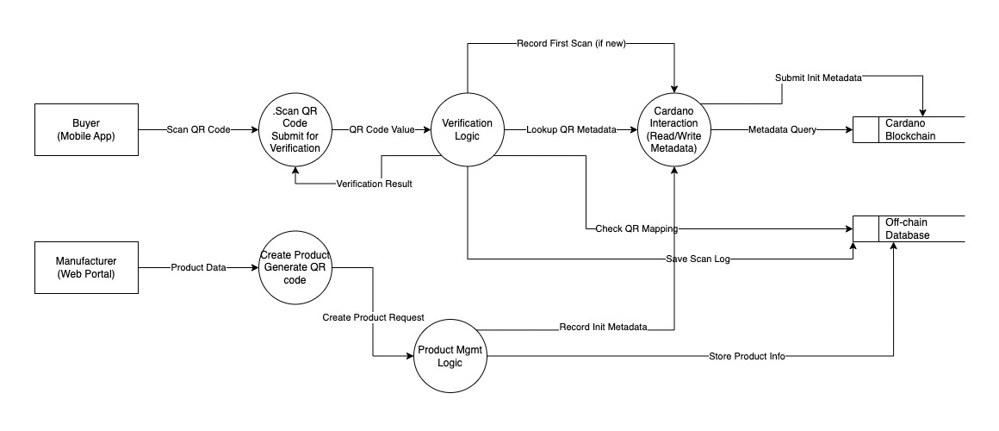
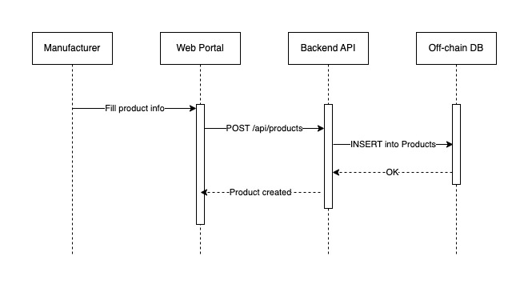
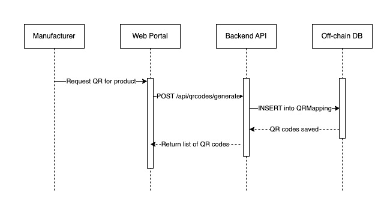
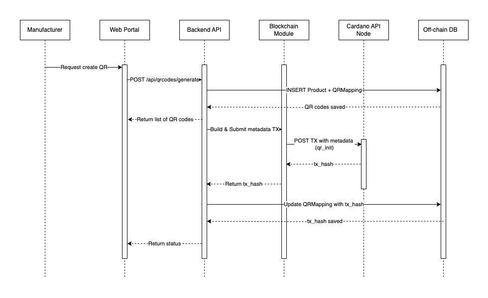
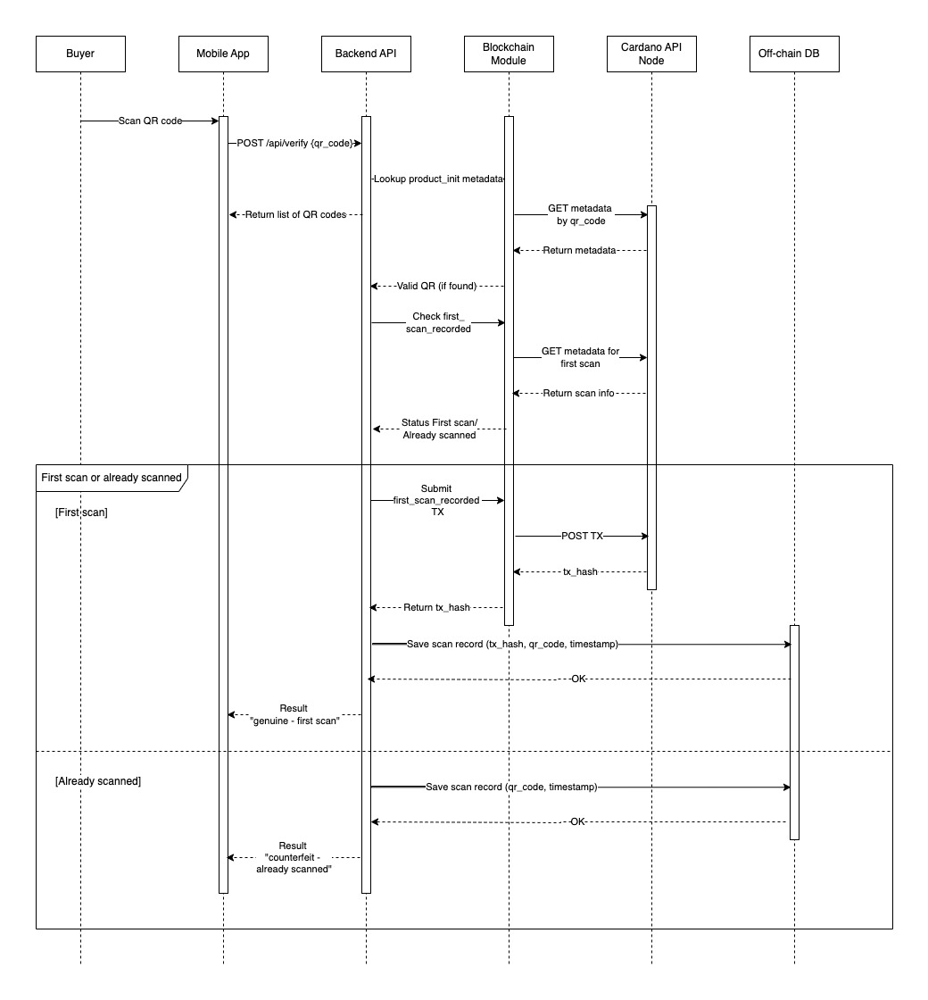
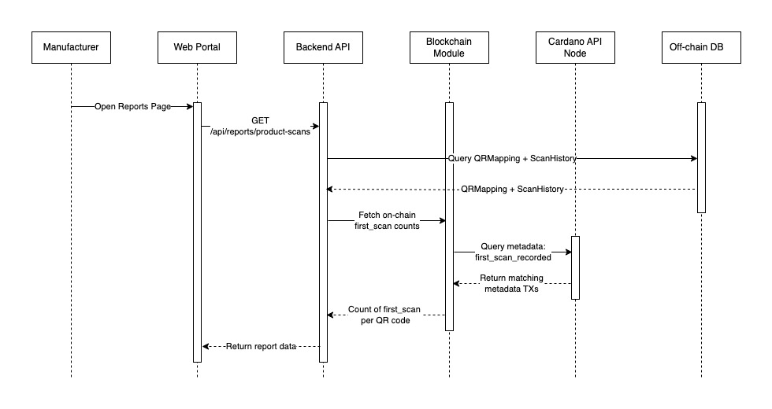

# Data Workflow

## Introduction

This document comprehensively describes the detailed data flow across all components of the anti-counterfeit QR code management system integrated with the Cardano blockchain. It covers each step of data movement, from the initial product creation and QR code assignment process (off-chain), the recording and retrieval of information on the Cardano blockchain (on-chain), to the interaction of the buyer through the mobile application and the management activities of the manufacturer on the web portal.

## Overall Data Flow

The system processes data through the following main workflows:

* Product and QR Code Management (Manufacturer - Off-chain).
* Recording Initial Product Information on the Blockchain (Optional - On-chain).
* Product Authentication (Buyer - Combination of Off-chain and On-chain).
* System Management (Manufacturer - Off-chain).
* Reporting and Analytics (Manufacturer - Off-chain).

## Detailed Data Flow by Workflow

### Product and QR Code Management (Manufacturer - Off-chain)

**Actors**: Manufacturer, Manufacturer Web Portal, Backend API, Off-chain Database.

* **Step 1**: The Manufacturer logs into the Manufacturer Web Portal via a web browser.
    * **Data Flow**:
        * Login information (username, password) is sent from the browser to the Backend API for authentication (via HTTPS).
        * The Backend API checks the information in the Off-chain Database (table `Users`).
        * Upon successful authentication, the Backend API returns a session token to the browser, which is stored in a cookie or local storage.

* **Step 2**: The Manufacturer accesses the product management page on the Manufacturer Web Portal.
    * **Data Flow**:
        * The browser sends a request (including the session token) to the Backend API to retrieve the list of products (GET request to the `/api/products` endpoint).
        * The Backend API queries product information from the Off-chain Database (table `Products`) and returns the product list (in JSON format) to the browser for display.

* **Step 3**: The Manufacturer creates a new product by entering information (product name, description, batch number, etc.) on the Manufacturer Web Portal and clicks the "Save" button.
    * **Data Flow**:
        * The new product information (including the session token) is sent from the browser to the Backend API (POST request to the `/api/products` endpoint).
        * The Backend API stores the new product information in the Off-chain Database (table `Products`) and returns a success status (in JSON format) to the browser.

* **Step 4**: The Manufacturer requests the generation of QR codes for one or more selected products on the Manufacturer Web Portal.
    * **Data Flow**:
        * The QR code generation request (containing a list of product IDs, including the session token) is sent from the browser to the Backend API (POST request to the `/api/qrcodes/generate` endpoint).
        * The Backend API generates a unique QR code for each product and stores the mapping between the QR code and the product ID in the Off-chain Database (table `QRMapping`).
        * The Backend API returns a list of the generated QR codes (in JSON format) to the browser for display (potentially as images for download or printing).

### Recording Initial Product Information on the Blockchain

**Actors**: Backend API, Cardano Blockchain.

* **Step 1**: When the Backend API receives a QR code generation request, after storing the off-chain mapping, it may create a Cardano transaction.
* **Step 2**: The Backend API queries detailed product information from the Off-chain Database based on the product ID.
* **Step 3**: The Backend API builds metadata for the Cardano transaction, including product information (`product_id`, `product_name`, `batch_number`, `manufacturing_date`) and the QR code (`qr_code_value`).
* **Step 4**: The Cardano Blockchain Interaction Module (within the Backend API) signs the transaction using the system's private key.
* **Step 5**: The Cardano Blockchain Interaction Module submits the signed transaction to the Cardano network via the API of the API node service (e.g., Blockfrost).
* **Step 6**: The Transaction ID (txid) of this transaction is stored in the Off-chain Database (table `QRMapping` or a separate table) to link with the QR code.

### Product Authentication (Buyer - Combination of Off-chain and On-chain)

**Actors**: Buyer, Mobile Application, Backend API, Cardano Blockchain, Off-chain Database.

* **Step 1**: The Buyer uses the Mobile Application to scan the QR code on the product.
* **Step 2**: The Mobile Application sends the QR code value (`qr_code_value`) to the Backend API (POST request to the `/api/verify` endpoint via HTTPS).
* **Step 3**: The Request Handling Module (Backend API) receives the request and forwards the `qr_code_value` to the Verification Processing Module.
* **Step 4**: The Verification Processing Module calls the Cardano Blockchain Interaction Module to query the Cardano blockchain.
    * It searches for transactions containing metadata related to the `qr_code_value`.
    * Specifically, it looks for the QR code initialization transaction (if this information is stored on the blockchain) to check the following information: `serial`, `start_id`, `end_id`, `checksum` (check code).
* **Step 5**: The Cardano Blockchain Interaction Module sends the query request to the API node and receives the results (a list of relevant metadata transactions).
* **Step 6**: The Verification Processing Module analyzes the results:
    * **QR Code Initialization Check**:
        * If no QR code initialization transaction containing the matching `serial`, `start_id`, `end_id`, and `checksum` is found according to the system's expected data, the Backend API returns a "counterfeit - invalid QR code" response (in JSON format) to the Mobile Application.
        * If the initialization information matches, the system proceeds to check the scan history.
    * **Scan History Check (if initialization information is valid)**: The Verification Processing Module continues to search for metadata transactions containing "first scan" information (`event`: `first_scan_recorded` and containing `qr_code`: `qr_code_value`).
        * If no previous scan transaction is found, the Verification Processing Module creates a new transaction.
        * The metadata of this transaction will contain the first scan information (`event`: `first_scan_recorded`, `qr_code`: `qr_code_value`, `scan_time`: current timestamp, potentially location/device information).
        * The Cardano Blockchain Interaction Module signs and submits this transaction to the blockchain.
        * The Transaction ID (txid) of this transaction may be stored in the Off-chain Database (table `QRMapping` or table `ScanHistory`).
        * The Backend API returns a "genuine - first scan" response (in JSON format) to the Mobile Application.
        * If at least one metadata transaction indicating a previous scan for the `qr_code_value` is found, the Verification Processing Module returns a "counterfeit - already scanned" response (in JSON format) to the Mobile Application.
    * **Error Condition**: If there is an error during communication with the blockchain or the database, the Backend API returns an error response (in JSON format) to the Mobile Application.
* **Step 7**: The Mobile Application receives the response (genuine/counterfeit/error) and displays the corresponding message to the buyer.

### System Management (Manufacturer - Off-chain)

**Actors**: Manufacturer, Administrator, Manufacturer Web Portal, Backend API, Off-chain Database.
* Processes similar to product management: User management (account creation, role assignment), system configuration (e.g., setting policies for writing to the blockchain), viewing activity logs.
* All these data flows primarily occur between the web browser (Manufacturer Web Portal), the Backend API, and the Off-chain Database (table `Users`, configuration table, logs table).

### Reporting and Analytics (Manufacturer - Off-chain)

**Actors**: Manufacturer, Manufacturer Web Portal, Backend API, Off-chain Database (and potentially Cardano Blockchain via API node).

* **Step 1**: The Manufacturer accesses the reporting page on the Manufacturer Web Portal.
    * **Data Flow**:
        * A request (including the session token) is sent from the browser to the Backend API (GET request to reporting endpoints, e.g., `/api/reports/product-scans`).
* **Step 2**: The Backend API queries the necessary data from the Off-chain Database (tables `QRMapping`, `ScanHistory` - if available) and may query information from the Cardano blockchain (via the API node to count the number of first scans).
* **Step 3**: The Backend API processes and aggregates the data into reports (e.g., number of tagged products, number of first scans over time, scan locations - if available).
* **Step 4**: The Backend API returns the report data (in JSON format) to the browser for display as tables, charts, etc.

## Conclusion

This document has detailed the data flow throughout the entire system, including both on-chain activities (interacting with the Cardano blockchain to record initialization information, verify validity, and check scan status) and off-chain activities (managing products, user interactions, storing supplementary data). The integration of QR code initialization information checks on the blockchain significantly strengthens the system's anti-counterfeiting capabilities.