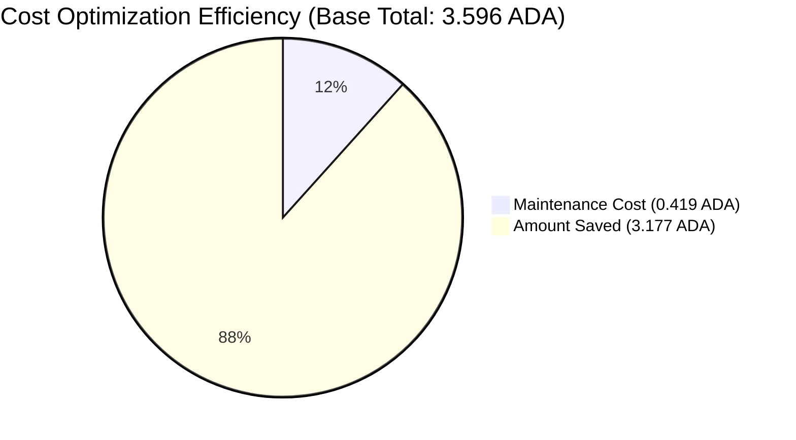
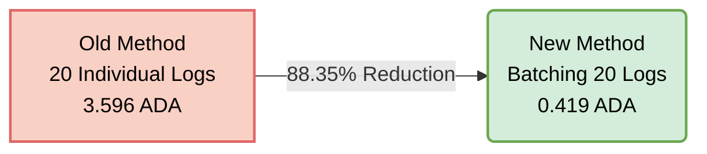

# Evidence 1: On-chain Cost Optimization

**Acceptance Criteria:** On-chain storage costs reduced by implementing batching processes, confirmed through transaction logs.

## 1.1. Optimization Approach
Included in the evidence storage directory is the statistical file `transaction_logs.xlsx`.
The system initially logged directly on-chain, with each modification history being a single transaction (Individual storage transaction). After optimizing the batching mechanism, the system is able to group multiple log IDs into a single Payload of one Transaction to save space and UTxO on the Cardano network.
The optimized cost is recorded to be around ~82% compared to recording each individual transaction separately, significantly reducing daily maintenance costs.

## 1.2. Transaction Logs (Before vs After)
Based on the data exported from the system (Data source: `transaction_logs.xlsx`), we compare the cost on a sample cluster of 10 update logs.

### Before Batching Optimization (Individual Storage):
The system processes each log into 1 transaction. Detail of 20 individual transactions from Sheet 1:
- **Tx 1:** `62db98e2515ce71a0323daae91b4fb316c78001f68d629c2d0ab277cc1b8c5a8` (Fee: 0.167217 ADA)
- **Tx 2:** `d6a3d5a758d9c963b169195828ddba9c82024460819d3c07d20aca885e222797` (Fee: 0.183189 ADA)
- **Tx 3:** `baf748d9353db8245c028665042f64390d8650a0ecd9b3579d8772a819a6787d` (Fee: 0.182441 ADA)
- **Tx 4:** `3d30d12de59cea60eae467e9c63af4174ccab30a3f7178de2ae6b747b8ea2dd0` (Fee: 0.182485 ADA)
- **Tx 5:** `9e8272c46682f5bddddc825e7e4faa9953d0e79a9928ef2fdc7c446cab54a551` (Fee: 0.182529 ADA)
- **Tx 6:** `ffae76edfc26e20dd3c950444f83f00aa1b8936f9c2a094aa0dec7eea649a3f9` (Fee: 0.182749 ADA)
- **Tx 7:** `a58a97a89d71acf9a7d516bb81b20c783ded6a11cef25164293fd8e6939da01b` (Fee: 0.181649 ADA)
- **Tx 8:** `c1ffede9de6fca8c6d99e954f391af7ddeacfb2da8e7c857d1c276af03475610` (Fee: 0.181649 ADA)
- **Tx 9:** `a1fd4bb94b0d6bc3a093f08e0dbb9df90df9928ab2c58b4b365157bdeaf00cf6` (Fee: 0.182353 ADA)
- **Tx 10:** `326826335dcfe5471691623b068168b758af51d305ed903700170275a5d903c8` (Fee: 0.181517 ADA)
- **Tx 11:** `50dc266547debf32464985484a737317df2aed03d70505ceb5392cf197e9b483` (Fee: 0.167217 ADA)
- **Tx 12:** `2e09372085275b9ec2dfdc55ea6daefc87f9cdb678b1f336b41c791367eebc83` (Fee: 0.167217 ADA)
- **Tx 13:** `90dd9c91f5e69ec173f1e3432a82715a40b92a0c343e27a94f5a10e57d4cb499` (Fee: 0.181385 ADA)
- **Tx 14:** `11cc6b05d4d2f6c251f7222d9ea9191d5427671338ad682e068ec532d49e9861` (Fee: 0.184069 ADA)
- **Tx 15:** `9ebe0070f7b2f8f9c4af2b20e54f3caff14071461014b517d736b5932f059e4d` (Fee: 0.181341 ADA)
- **Tx 16:** `88fbbaa9c00f2ad109fda6a1ab273a12e56a0a873e6281f28cdc48b73b737978` (Fee: 0.182177 ADA)
- **Tx 17:** `96089c1a3ce84c100f831932a07893c3e43a7f5f79c47cc5b5dee043d61aafee` (Fee: 0.181517 ADA)
- **Tx 18:** `84cf397df850ec723542a84a0962ebcaa830d50f1f84f80bb7fb3ec686fbe87b` (Fee: 0.181517 ADA)
- **Tx 19:** `26830462c5c02c7388da56cbad9e3f1a0c4ac95bfc0745b7947400f86d4c5d13` (Fee: 0.181121 ADA)
- **Tx 20:** `d3f561c00bb5de55da8f7015b00bc3c5f3e5da4ff5de1ab1c7cc6cad8af2c1e1` (Fee: 0.180857 ADA)
- **Total individual cost (for 20 records):** **3.596196 ADA**

### After Batching Optimization (Applying Batching Mechanism):
With the application of the Batch Queue mechanism, the system optimally packed multiple records together into a single metadata recorded on the chain.
- **Transaction Hash as proof:** `7d045954a96464b6527ac5d534016a835d8b8e86d6f73883481eb83b7ff7335b`
- **Batch Size:** 20 records in 1 Payload 
- **Batch Log IDs:** `{8277574, 8288208, 8288940, 8288945, 8288996, 8300288, 8310200, 8310213, 8310558, 8313160, 8313171, 8313176, 8314825, 8314963, 8329941, 8332751, 8367215, 8501011, 8527902, 8532728}`
- **Actual On-chain Fee/Cost:** **0.419073 ADA**

## 1.3. Cost Reduction Summary

**Data Source:** `transaction_logs.xlsx`
- **Sheet 1:** 20 individual transactions (before optimization)
- **Sheet 2:** 1 batch transaction with 20 log IDs (after optimization)

**Comparison based on 20 records processed:**
- **Old method cost (20 discrete Tx):** **3.596196 ADA**
- **New method cost (1 Tx combining 20 logs):** **0.419073 ADA**
- **Total ADA saved (per 20 records):** **3.177123 ADA**
- **On-chain cost reduction rate:** Reached an optimal level of **~88.35%**

### Visual Charts

*(For detailed reconciliation data, please see the attached file `transaction_logs.xlsx`)*
