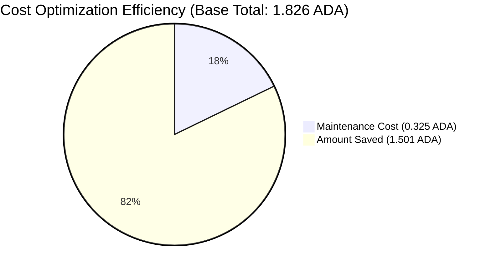
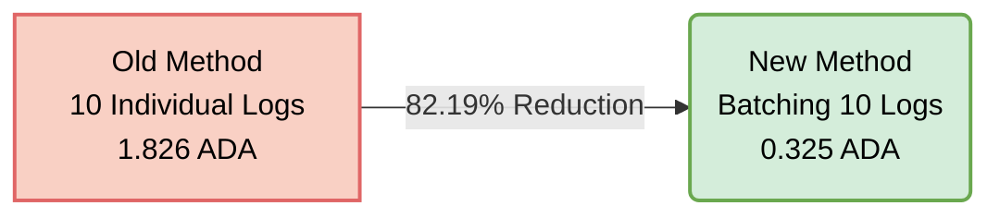

# Evidence 1: On-chain Cost Optimization

**Acceptance Criteria:** On-chain storage costs reduced by implementing batching processes, confirmed through transaction logs.

## 1.1. Optimization Approach
Included in the evidence storage directory is the statistical file `transaction_logs.xlsx`.
The system initially logged directly on-chain, with each modification history being a single transaction (Individual storage transaction). After optimizing the batching mechanism, the system is able to group multiple log IDs into a single Payload of one Transaction to save space and UTxO on the Cardano network.
The optimized cost is recorded to be around ~82% compared to recording each individual transaction separately, significantly reducing daily maintenance costs.

## 1.2. Transaction Logs (Before vs After)
Based on the data exported from the system (Data source: `transaction_logs.xlsx`), we compare the cost on a sample cluster of 10 update logs.

### Before Batching Optimization (Individual Storage):
The system processes each log into 1 transaction. Detail of 10 individual transactions:
- **Tx 1:** `8111dc5bddbc8ab89cab832ee4e86a5d695494e12f7338741268e36ba9412a4c` (Fee: 0.185433 ADA)
- **Tx 2:** `5613b2398b4e7b600825a9e15ae15e61bc2fc87a91397863b42b7d3c6445d598` (Fee: 0.181297 ADA)
- **Tx 3:** `3399087398040221218d157f5062399a8dde3a332a9e91f3609e6de83f5c0093` (Fee: 0.181693 ADA)
- **Tx 4:** `9a49c43a00013a3e2bc3523ef9befc7beec91e607af1336610c36408c811d77b` (Fee: 0.181737 ADA)
- **Tx 5:** `13e069dd41f2b5fc86d97d4eb6b2c166acff04ff36a1594f927e3d84cfd16822` (Fee: 0.182133 ADA)
- **Tx 6:** `4ae786b5f30d1d88ce243cc121f4c53926e36287e966b4ea1b5c234f3bd1ba84` (Fee: 0.181825 ADA)
- **Tx 7:** `7478cec0c6c5cba65bca48cc4ef871675d99dc481413f8e7a7db6c250e439d45` (Fee: 0.181957 ADA)
- **Tx 8:** `f648cb3451feab60209d8c130caaa003f49b29612d6bd8a875e1038378455d21` (Fee: 0.184289 ADA)
- **Tx 9:** `80ebee4ee292431784c967b0fefe3ea9dcbbdff31d3946dec54161f78a6bf0a9` (Fee: 0.184949 ADA)
- **Tx 10:** `87e1f6e2bdc96ee9fea34eb082e1447ff3c2aa51220a4260eed9a9ad4b7d95a2` (Fee: 0.181033 ADA)
- **Total individual cost (for 10 records):** **1.826346 ADA**

### After Batching Optimization (Applying Batching Mechanism):
With the application of the Batch Queue mechanism, the 10 records mentioned above were optimally packed together into a single metadata recorded on the chain.
- **Transaction Hash as proof:** `2d96d8746e4b5d923d0d274ea5b5d11cbfccf46c1db01a7cc5d2fbc45d300db3`
- **Batch Size:** 10 records in 1 Payload *(batch_log_ids: {213854, 213857, 213858, 213859, 213860, 213861, 213862, 213864, 213865, 213866})*
- **Actual On-chain Fee/Cost:** **0.325265 ADA**

## 1.3. Cost Reduction Summary
- **Old method cost (10 discrete Tx):** 1.826346 ADA
- **New method cost (1 Tx combining 10 logs):** 0.325265 ADA
- **Total ADA saved (per 10 records):** 1.501081 ADA
- **On-chain cost reduction rate:** Reached an optimal level of **~82.19%**

### Visual Charts

*(For detailed reconciliation data, please see the attached file `transaction_logs.xlsx`)*
