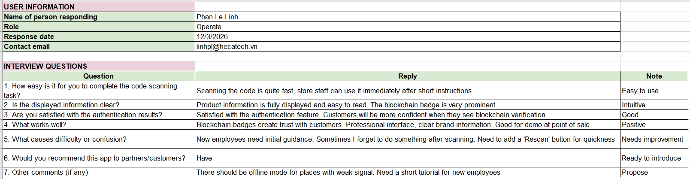
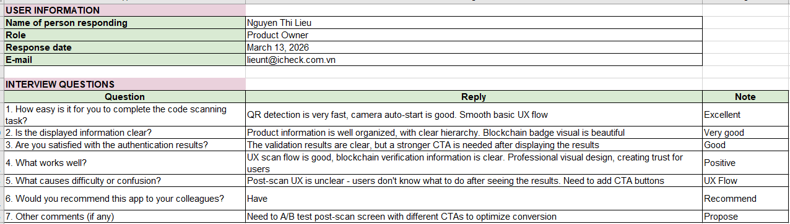
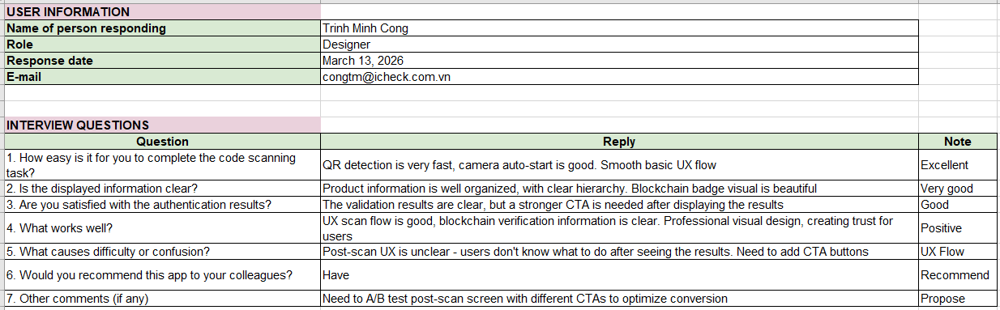
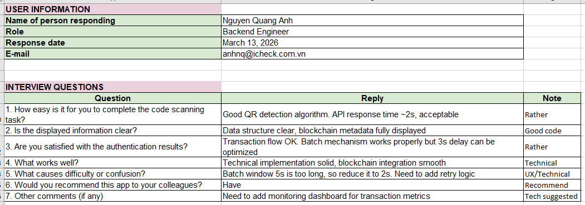
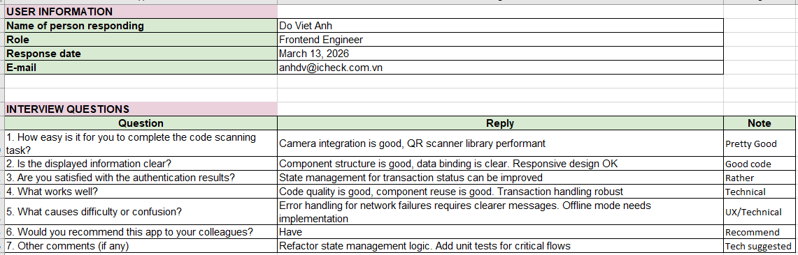
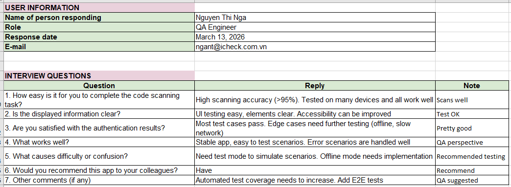
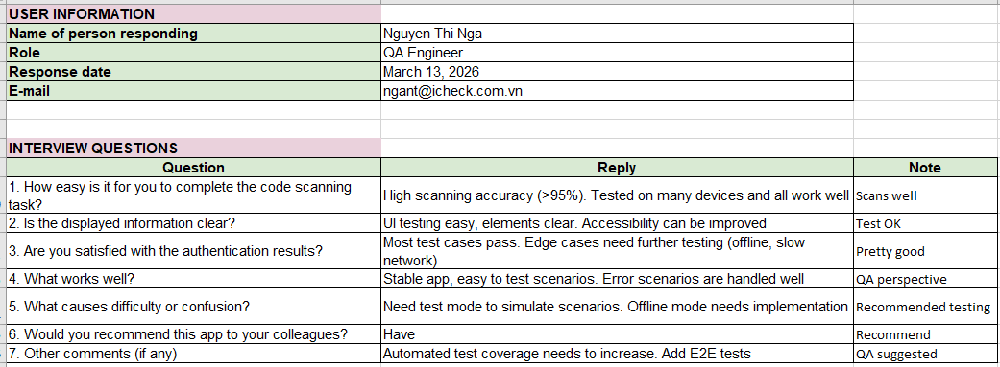

# Evidence 3: User Feedback Summary

**Acceptance Criteria:** Collect basic feedback from pilot users, highlighting key insights for improvement.

---

## 3.1. Pilot User Group Details

*Detailed information about the pilot user group.*
- **Total Users:** 8
- **User Profile:** 
  - Internal Users: 6
  - External Clients: 2

---

## 3.2. Feedback Collection Methods

*Methods used to collect user feedback.*
- Direct interviews with pilot users.
- Observation during trial usage.
- Manual note-taking by support/product team.
- Basic feedback forms after completing trial scenarios.

---

## 3.3. Key Insights and Feedback

*Summary of feedback and detailed analysis of collected insights.*

### Positive Feedback:
- Data display is relatively clear, information is intuitive and good.

### Areas for Improvement:
- **UX Flow:** User experience flow is unclear after the scanning step.
- **Transaction Status:** Need more transparency and clarity on transaction status after users perform scanning.
- **Latency Experience:** There is about 3 seconds delay due to batching mechanism, but at an acceptable level (Low Impact).

### Raw Feedback:
| No. | Detailed Feedback |
|-----|-------------------|
| 1   | Scanning is fast but next steps are unclear. |
| 2   | About 3 seconds delay. |
| 3   | Information display is good. |
| 4   | Need clearer transaction status after scanning. |

---

## 3.4. Detailed User Evidence

### External Client: Mydico

- **Verification Video:** [Watch Mydico Interview Video](https://drive.google.com/file/d/1UIOhVSiEruoV3f8_UlEQ2XW1Xb5ELb-q/view)
*(Note: Detailed feedback and evaluation from Mydico were gathered via direct video interview.)*

---

### External Client: Hecatech

---

### Internal User: Product Owner (Nguyen Thi Lieu)

---

### Internal User: Designer (Trinh Minh Cong)

---

### Internal User: Backend Engineer (Nguyen Quang Anh)

---

### Internal User: Frontend Engineer (Do Viet Anh)

---

### Internal User: QA Engineer (Nguyen Thi Nga)

---

### Internal User: Customer Service (Nguyen Thi Thuy Linh)

---

## 3.5. Next Steps / Action Plan

*Plan to address feedback and improve the system in the next phase.*

### Optimization Plan for Discovered Issues:

- **Add instruction UI after scan** (Priority: High): Add instructional UI immediately after scanning to resolve the unclear UX issue.
- **Add submitted/confirmed status indicator** (Priority: High): Add transaction status display (submitted/confirmed) to make the status transparent.
- **Reduce batch window from 5s to 2s** (Priority: Medium): Reduce the Batch waiting time from 5 seconds down to 2 seconds to overcome the delay situation.

### Next Phase Plan:

- Optimize real-time batching logic to minimize delay.
- Upgrade the ability to track progression and transaction statuses on the UI.
- Scale from 8 users to 100+ users.
- Prepare production-readiness checklist.

---

## 3.6. Related Documents and Links

### Detailed Data:
- **Raw Feedback Data (Vietnamese):** `Raw_Feedback.xlsx`
- **Translated Feedback Data (English):** `Feedback_EN.xlsx`
- **Video Mydico:** https://drive.google.com/file/d/1UIOhVSiEruoV3f8_UlEQ2XW1Xb5ELb-q/view

### Screenshots (saved in `artifacts/`):
- `artifacts/`
  - hecatech_feedback.png
  - product_owner_feedback.png
  - designer_feedback.png
  - backend_engineer_feedback.png
  - frontend_engineer_feedback.png
  - qa_engineer_feedback.png
  - customer_service_feedback.png

---

